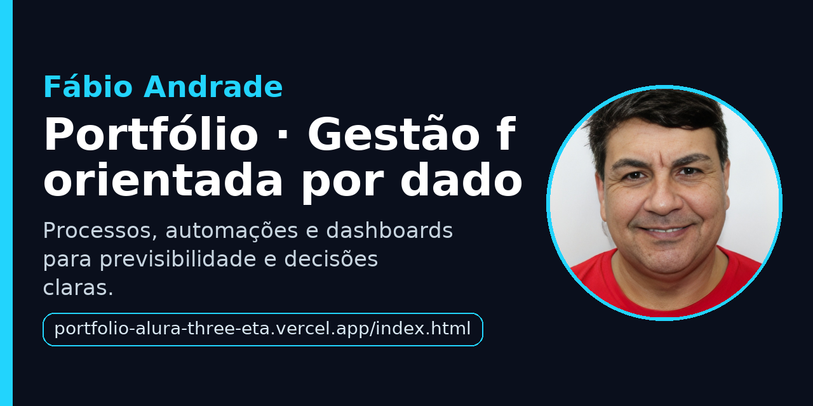

# Portfólio — Fábio Andrade

Site de portfólio em **HTML** e **CSS**, baseado no projeto da formação Alura e personalizado com minha identidade. Foco em **gestão financeira orientada por dados**, processos padronizados, automações e dashboards para previsibilidade e decisões claras.

- **Site em produção:** https://portfolio-alura-three-eta.vercel.app/index.html  
- **Perfil GitHub:** https://github.com/thedrads  
- **LinkedIn:** https://www.linkedin.com/in/fabioandradegf/  
- **Instagram:** https://www.instagram.com/fabioandrade.gf  

---

## 👀 Preview rápido
- **Home:** eficiência financeira movida a dados, com texto claro e direto  
- **Sobre mim:** trajetória focada em organização de fluxos, automações e indicadores

---

## 🧰 Tecnologias
- HTML5  
- CSS3  
- Google Fonts: Krona One, Montserrat

---

## 📂 Estrutura
/
├─ index.html
├─ about.html
├─ styles/
│  └─ style.css
└─ assets/
   ├─ 3x4.jpg
   ├─ github.png
   ├─ linkedin.png
   └─ instagram.png
